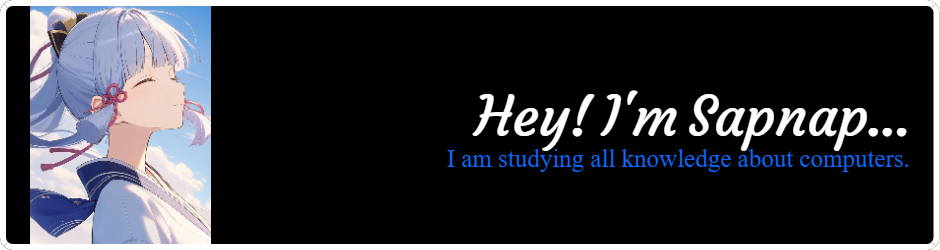

## Hello I'm Sapnap💲

👨‍💼 I'm currently not working. 
📓 I'm currently learning the **C++** programing language.

##### Skills

##### Framework & Library

##### Asistant AI

##### Community

##### Blog

#### IDE

##### OS

##### Prototyping platforms

##### Scurity Platforms

##### Security Tools

##### Connect with me

##### My collection of work

<!--
**Sapnap00000/Sapnap00000** is a ✨ _special_ ✨ repository because its `README.md` (this file) appears on your GitHub profile.

- 🔭 I’m currently working on ...
- 🌱 I’m currently learning ...
- 👯 I’m looking to collaborate on ...
- 🤔 I’m looking for help with ...
- 💬 Ask me about ...
- 📫 How to reach me: ...
- 😄 Pronouns: ...
- ⚡ Fun fact: ...
-->
